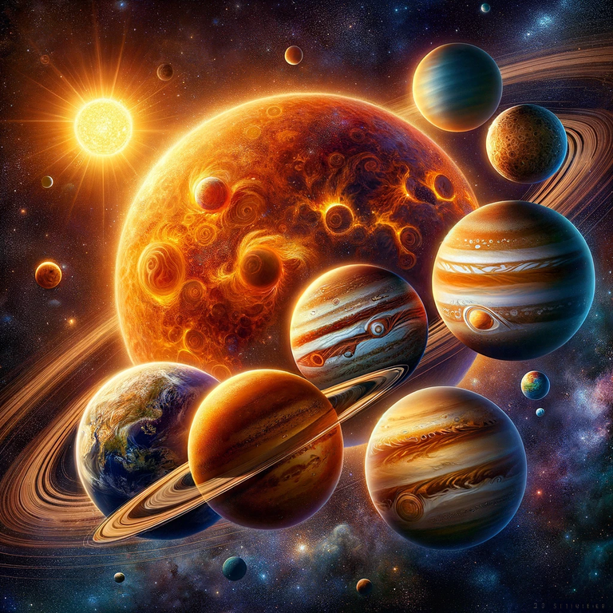

\newpage

## Table des Matières

1. [Introduction](#1-introduction)
   - [1.1 Contexte du projet](#contexte-du-projet)
   - [1.2 Objectifs du projet](#objectifs-du-projet)
   - [1.3 Importance des Simulations Numériques en Physique](#importance-des-simulations-numériques-en-physique)
   - [1.4 Structure du rapport](#structure-du-rapport)
2. [Fondements théoriques](#fondements-théoriques)
   - [2.1 Moteur physique](#moteur-physique)
     - [2.1.1 Création de l'étoile et des planètes](#création-de-létoile-et-des-planètes)
     - [2.1.2 Définition des conditions initiales](#définition-des-conditions-initiales)
     - [2.1.3 Simulation de l'évolution](#simulation-de-lévolution)
   - [2.2 Moteur graphique](#moteur-graphique)
     - [2.2.1 Adaptation à l'écran](#adaptation-à-lécran)
     - [2.2.2 Affichage des objets](#affichage-des-objets)
     - [2.2.3 Fonctionnement global du moteur graphique](#fonctionnement-global-du-moteur-graphique)
3. [Résultats](#3-résultats)
   - [3.1 Scénario 1 : Comparaison avec les données réelles](#scénario-1-comparaison-avec-les-données-réelles)
   - [3.2 Scénario 2 : Le Soleil sans masse](#scénario-2-le-soleil-sans-masse)
   - [3.3 Scénario 3 : Égalisation des masses de la Terre et de Mars](#scénario-3-égalisation-des-masses-de-la-terre-et-de-mars)
   - [3.4 Question de la mort : Déterminer quelle est la planète qui en moyenne est la plus proche de la terre.](#question-de-la-mort)
4. [Conclusion](#4-conclusion)
5. [Table des figures](#5-table-des-figures)

\newpage

# 1. Introduction

## Contexte du projet
De nos jours les simulations numériques jouent un rôle essentiel pour comprendre et étudier les phénomènes complexes qui se produisent dans notre univers. Embarquez avec nous pour ce voyage dans l'immensité de l'espace. Vous decouvrierez comment les planètes interragissent les unes avec les autres autour d'une étoile commune. Ce projet a été réalisé sous la direction de Dr Orestis Malaspinas dans le cadre du cours de Physique de première année.

Pour simplifier, nous avons créé un modèle informatique d'un système planétaire fictif, similaire à notre propre système solaire. Dans ce modèle, il y a une étoile au centre et plusieurs planètes qui tournent autour d'elle. Ces planètes sont soumises à des forces gravitationnelles, tout comme dans la réalité.

## Objectifs du projet
Notre objectif est de vous montrer comment ces interactions gravitationnelles fonctionnent, comment elles influencent les mouvements des planètes et comment différents paramètres, tels que la masse des objets célestes ou la forme de leurs orbites, peuvent avoir un impact sur le système. Nous utilisons le langage de programmation C pour créer cette simulation numérique, et nous utilisons les lois de Newton, des principes fondamentaux de la physique, comme base théorique pour guider nos calculs.

## Importance des Simulations Numériques en Physique

Ce projet nous permet de voir et de simuler l'évolution de notre systeme solaire. On peut en extraire deux fonctions principales :

### Prédiction du Comportement : 
Les simulations nous permettent de prédire le comportement futur des nos planètes dans notre système. Si nous envisageons un voyage vers Mars, nous devons savoir où Mars sera située à un instant t précis.

### Validation des Connaissances : 
Les simulations nous permettent de mieux comprendre les phénomènes naturels. En comparant les résultats de nos simulations aux observations réelles, nous pouvons évaluer la précision de nos modèles et détecter d'éventuelles incohérences. Prenons le cas de la position simulée de Vénus étant sensiblement sortie de son orbite alors nous devront revoir les calculs et données utilisés.

## Structure du rapport
Dans ce rapport, nous expliquerons en détail comment nous avons mis en place cette simulation, quelles équations nous avons utilisées, et quelles données sont nécessaires. Nous illustrerons également les résultats que nous avons obtenus en observant le comportement de notre système planétaire virtuel. Enfin, nous conclurons en discutant de l'importance de ce travail et en suggérant des pistes pour de futures travaux de recherches.

# 2. Fondements théoriques

Pour comprendre le fonctionnement de notre simulation de système planétaire, il est essentiel de distinguer le moteur physique *(back-end)* du moteur graphique *(front-end)*.

## Moteur physique

Le moteur physique est responsable de la simulation des mouvements et des interactions entre les objets célestes. L'explication qui va suivre permet de comprendre comment il opère.

### Création de l'étoile et des planètes 
Avant de commencer il est important de rappeler que dans notre simulation, nous représentons un système planétaire inspiré de notre système solaire où toutes les planètes sont sur le même plan. Au centre ce celui-ci nous retrouvons une étoile fixe et un certain nombre de planètes qui orbitent autour de cette dernière.

Au début de la simulation, nous créons donc une étoile au centre de notre domaine et ajoutons autant de planètes que nécessaire autour de l'étoile. Ce nombre de planète est fixé dans le fichier `planet.h`. C'est d'ailleurs dans ce fichier que toutes les constantes permettant le fonctionnement de la simulation sont initialisées. 

Pour représenter ces entités dans notre code, nous utilisons deux structures de données : `planet_t` et `system_t`.

#### La structure planet_t\

La structure `planet_t` est utilisée pour représenter chaque planète dans notre simulation. Elle contient plusieurs attributs essentiels, tels que la masse de la planète, son demi-grand axe, son excentricité, son rayon, sa position, sa vitesse initiale et sa couleur. Cette structure nous permet de stocker et de manipuler toutes les données nécessaires pour modéliser le comportement de chaque planète.

#### La structure system_t\
La structure `system_t` est utilisée pour représenter l'ensemble du système planétaire simulé. Elle contient des informations sur l'étoile centrale et un tableau des planètes en orbite. Cela nous permet de regrouper toutes les entités du système et de les gérer efficacement.

#### Librairie vec2\

Pour effectuer des calculs vectoriels en 2D, nous avons développé notre propre librairie appelée vec2. Cette librairie personnalisée nous offre un ensemble de fonctions pour créer, manipuler et effectuer des opérations mathématiques sur des vecteurs 2D, tout en étant parfaitement adaptée à nos besoins spécifiques dans la simulation. [Cf. Figure 1](#5-table-des-figures)

### Définition des conditions initiales
La définition des conditions initiales de chaque planète est une étape à ne pas négliger pour simuler de manière précise les mouvements au sein de notre système planétaire virtuel. Dans cette section, nous expliquerons comment nous avons calculé la position initiale, la vitesse initiale et l'accélération initiale de chaque planète, en utilisant des formules basées sur les principes de la physique newtonienne. Ces calculs sont effectués dans le fichier `planet.c` de notre projet.

#### 2.1.2 Position initiale\

Pour définir la position initiale de chaque planète, nous utilisons la notion de périhélie. La périhélie est la position la plus proche de l'étoile autour de laquelle la planète orbite. Dans notre simulation, nous plaçons la position initiale de chaque planète aux périhélies de chaque orbite respectives.

[Voir Figure 2](#5-table-des-figures)

Au départ, l’étoile occupe la position centrale
et les planètes sont sur l’axe horizontal à la distance que l’on appelle périhélie, c’est la position 0.

Pour le faire nous initialisons toutes les positions des planètes en utilisant une fonction permettant de renvoyer la distance à la périhélie de la planète : 

```c
planet.pos = vec2_create(perihelie(planet), 0);
```

Ensuite il est nécessaire de calculer la vitesse initiale des planètes.

#### Vitesse initiale\

La vitesse initiale de chaque planète est calculée en fonction de son orbite elliptique. Pour obtenir la vitesse initiale *v*, nous utilisons la formule suivante :

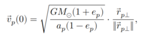

Dans cette formule, *G* est la constante gravitationnelle, *M* est la masse de l'étoile centrale, *ep* est l'excentricité de l'orbite de la planète, *rp |* est le vecteur perpendiculaire entre la planète et son étoile. *rp|.x* correspond à l'opposé de *rp.y* et *rp|.y* à *rp.x*. 
Et pour finir *ap* est le demi-grand axe de l'orbite de la planète.

C'est la fonction `init_planet_speed` qui s'en charge.

#### Calcul de la première position\

Avant de commencer la simulation en cours, il est essentiel de calculer la première position de chaque planète. Cette position initiale est calculée en utilisant la fonction `update_initial_position`. La méthode prend en compte des paramètres tels que le delta de temps (`delta_t`) et la vitesse initiale des planètes. Cette première position est déterminée en fonction de la périhélie de l'orbite de chaque planète et de son vecteur vitesse initial. 

`delta_t` représente l'intervalle de temps entre chaque étape de la simulation, c'est-à-dire la quantité de temps que chaque itération de la simulation représente dans le monde réel.

Plus précisément, `delta_t` détermine la finesse de la discrétisation temporelle de la simulation. Une valeur plus petite de `delta_t` signifie que chaque étape de la simulation représente un petit laps de temps, ce qui permet une simulation plus précise, mais qui peut nécessiter plus d'itérations pour représenter une période donnée. À l'inverse, une valeur plus grande de `delta_t` signifie que chaque étape représente un intervalle de temps plus long, ce qui peut accélérer la simulation, mais avec une précision potentiellement réduite.

La fonction repose sur la formule suivante :

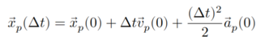

### Simulation de l'évolution

Le coeur de notre simulation réside dans le moteur physique, qui est responsable de simuler l'évolution temporelle du système planétaire. Cette section détaille le processus par lequel le moteur physique effectue cette simulation en plusieurs étapes clés.

#### Affichage du système\

À chaque étape de la simulation, le moteur graphique (front-end) affiche l'état actuel du système planétaire. Cette visualisation en temps réel nous permet d'observer les mouvements et les interactions des objets célestes tout au long de la simulation. Nous y reviendrons dans la partie moteur graphique.

#### Calcul de la force résultante\

Le moteur physique calcule la force résultante agissant sur chaque planète dans le système. Cette force résultante est le résultat des interactions gravitationnelles entre toutes les planètes et l'étoile centrale. Pour calculer cette force, nous utilisons la loi universelle de la gravitation de Newton, qui décrit comment deux objets massifs interagissent gravitationnellement. Pour deux planètes *Q* et *P*, de masse *mq* et *mp* en kg, il suffit d'utiliser la constante gravitationnelle *G* qui vaut 6.67.10^-11 *m³/kg.s²*, et d'appliquer la formule suivante :

Avec le vecteur *rpq* reliant *P* et *Q* en m.

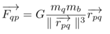

Elle est calculée dans la fonction `calculate_gravitational_force`, et pour la force résultante, il suffit de faire la somme des forces pour chaque planète en utilisant notre tableau de planète de notre système, cela se fait dans la fonction `calculate_resultant_force_planet`.

#### Accéleration\

L'accélération résultante est calculée en divisant la force par la masse de la planète :

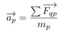

Avec la somme des forces appliquées par les corps célestes sur la planètes *N* et *mp* la masse de la planète en kg. On retrouve ce calcul dans la fonction `acceleration`

#### Calcul de la prochaine position\

Puis, à l'aide de cette accélération, la nouvelle position de la planète est calculée. 

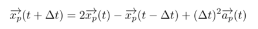

Avec le vecteur *ap* l'accéleration en *m/s²* et delta_t l'intervalle de temps entre deux positions en *s*.

On retrouve ces calculs dans la fonction `update_pos` qui est elle même lancé dans la fonction `update_system` juste après avoir récuperé les données nécessaires. [Cf. Figure 8](#5-table-des-figures)

Ces calculs sont effectués pour chaque planète dans le système, ce qui permet de prévoir leur mouvement futur.
\newpage

#### Mise à jour des positions et répétition du processus\

Après avoir calculé la force résultante agissant sur chaque planète et déterminé la prochaine position des planètes à l'aide des lois de Newton et des équations de mouvement, nous mettons à jour la position actuelle de chaque planète. Cette mise à jour est essentielle pour suivre l'évolution temporelle du système.

Pour effectuer cette mise à jour, nous utilisons un paramètre clé appelé "delta_t". Il représente l'intervalle de temps entre chaque itération de la simulation. Il dicte à quelle vitesse le temps s'écoule dans notre simulation. 

À chaque itération, nous calculons la nouvelle position de chaque planète en fonction de la force résultante et de `delta_t`. Cette nouvelle position est ensuite utilisée comme la nouvelle position actuelle de la planète.

```c
planet.prec_pos = pos
```

Nous répétons ensuite ce processus pour chaque instant de la simulation, permettant ainsi de modéliser le mouvement des planètes au fil du temps. 

En résumé, ces étapes représentent le cœur du moteur physique de notre simulation, où chaque planète est soumise aux forces gravitationnelles et évolue dans le temps en fonction de ces forces. Cette répétition itérative crée une animation qui montre comment les planètes se déplacent et orbites autour de l'étoile centrale dans le système planétaire simulé.

### Fonctionnement global du moteur physique

Afin d'illustrer au mieux le fonctionnement et la structure de notre fichier main voici un diagramme représentant le fonctionnement globale dumoteur physique. [Cf. Figure 9](#5-table-des-figures)

### Données utilisés
Voici ci-dessous les données que nous avons utilisées pour chaque scénarios, ci-joint : dossier ressources/planets du projet : 

\newpage

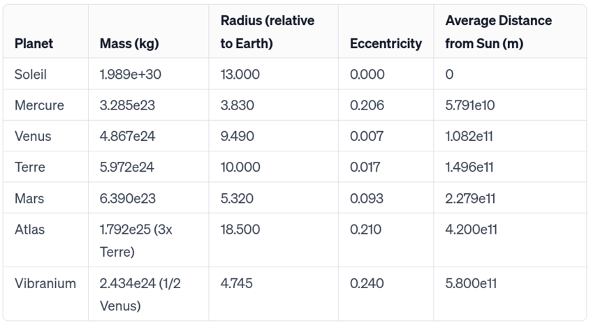

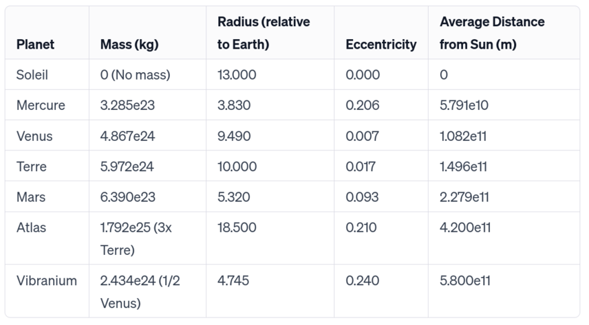

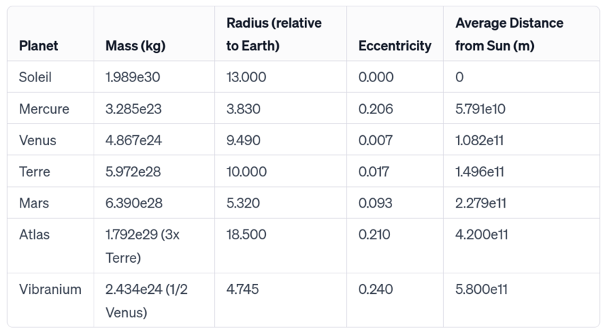

## Moteur graphique

### Adaptation à l'écran

À chaque étape de la simulation, le moteur graphique prend les positions actuelles des objets célestes, telles que calculées par le moteur physique, et les adapte à l'écran de visualisation. Cette étape est essentielle et permet de convertir les coordonnées spatiales en coordonnées d'écran, de sorte que les objets célestes soient correctement affichés sur la fenêtre de visualisation.

Pour l'adaptation à l'écran, nous utilisons une fonction appelée `vec2_to_coordinates` qui prend en compte la taille de l'écran et convertit les coordonnées spatiales en coordonnées d'écran en utilisant une échelle adaptée. [Cf. Figure 13](#5-table-des-figures)

### Affichage des objets

Une fois que les positions des objets célestes ont été adaptées à l'écran, le moteur graphique procède à l'affichage de ces objets. Il représente chaque planète et l'étoile sous forme de pixels ou d'éléments visuels, en respectant les échelles de taille définies pour chaque objet.

Dans la fonction `show_system`; la variable RS représente la distance aphélie de la dernière planète (Vibranium) avec une augmentation de 25%. C'est essentiellement une valeur qui définit l'échelle de notre système planétaire. Toutes les distances dans notre simulation sont exprimées en multiples de RS. Ainsi, RS est utilisé comme unité de référence pour les distances entre les objets célestes.

Ensuite nous avons définis des tailles d'affichage pour chaque planète en fonction de la taille choisis pour la Terre, `DISPLAY_EARTH`. Ci-dessous un tableau relatant des différent ratios de chaque planète par rapport à celui de la Terre.

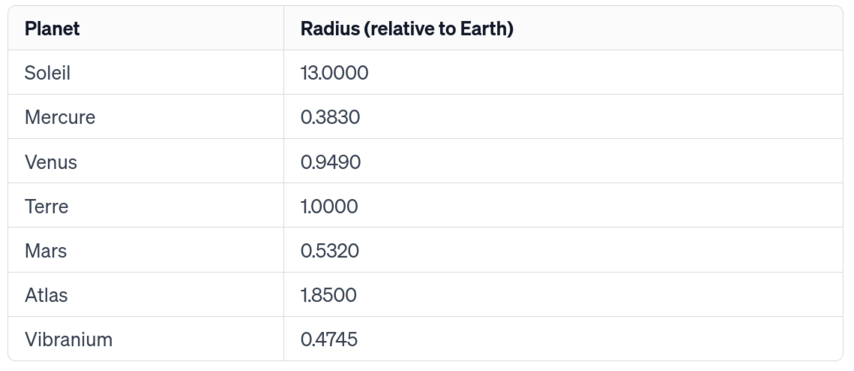

Voici un diagrame explicant plus en détails, le fonctionnement de la fonction permettant l'affichage. [Cf. Figure 15](#5-table-des-figures)

### Fonctionnement global du moteur graphique

En somme, le moteur graphique assure une visualisation en temps réel du système planétaire simulé grâce à une répétition continue du processus.

À chaque étape de la simulation, il adapte les positions spatiales des objets célestes à l'écran, les affiche en fonction de leurs coordonnées adaptées, et répète cette séquence pour chaque instant de la simulation. 

## 3. Résultats

### Scénario 1 : Comparaison avec les données réelles

Dans ce premier scénario, nous allons présenter comment notre simulation se compare aux données réelles. Notre simulation est conçue pour être flexible, et pour changer de scénario, il suffit de modifier une constante dans le fichier "planet.h". Cette caractéristique nous permet d'explorer différentes configurations du système planétaire.

Pour ce premier scénario, nous avons configuré notre simulation pour reproduire les paramètres du système solaire. Les images ci-dessous et la vidéo numéro 1 montrent l'évolution de notre système planétaire simulé.

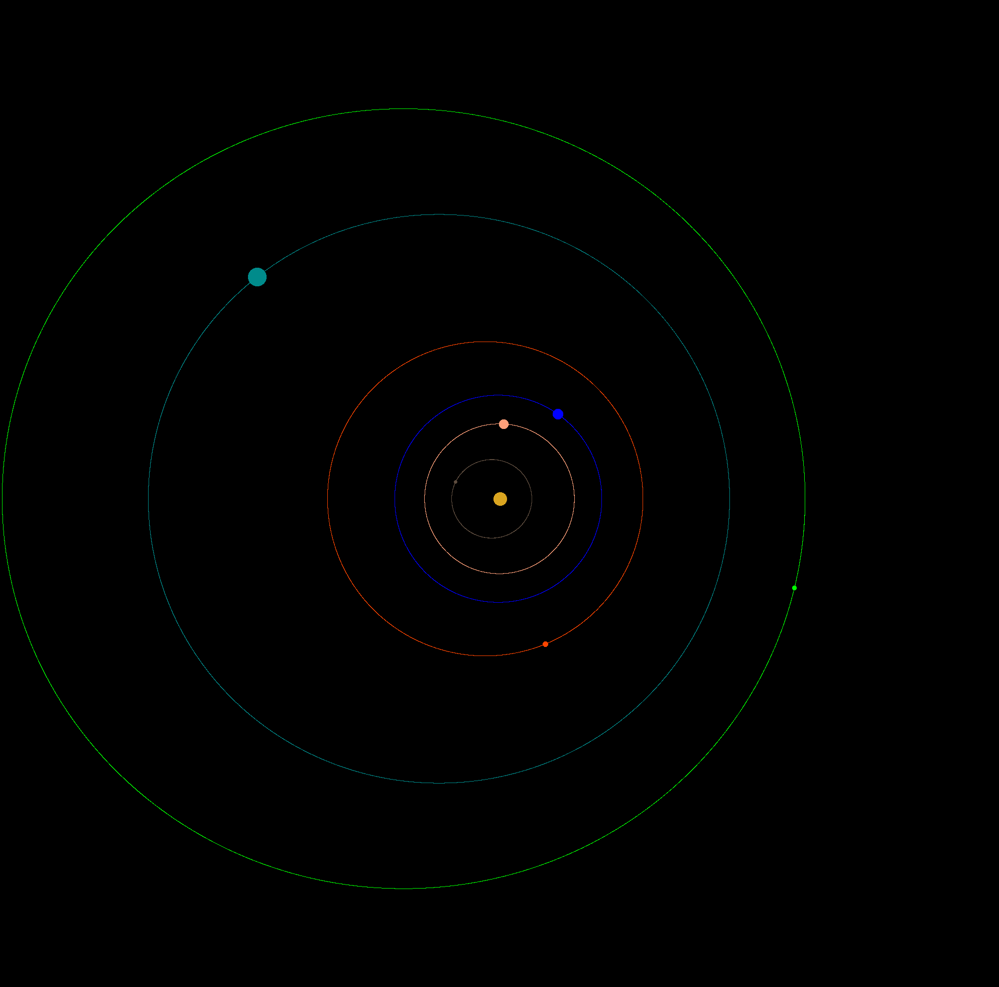

Ce premier scénario nous permet de vérifier la précision de notre modèle par rapport aux données astronomiques. En effet nous ne nous sommes pas arretés à une vérification visuelle mais avons mis en place une fonction permettant de calculer le nombres d'itérations néceessaires pour chaque planète jusqu'à ce qu'elles aient atteint leurs positions initiales (Période de révolution). 
Ensuite il suffit de faire correspondre le nombre d'itérations nécessaires à la planète Terre à t = 1 an. Enfin, une règle de trois nous permet de trouver les pourcentages corrects des temps de révolution des planètes par rapport à la durée de l'année terrestre : 

Résultats théoriques : 
Mercure : Environ 25,9% de l'année terrestre.
Vénus : Environ 63,7% de l'année terrestre.
Terre : 100% de l'année terrestre.
Mars : Environ 189,7% de l'année terrestre.

Résultats de notre simulation :
Mercure : 3041 itérations soit environ 32% de l'année terrestre.
Vénus : 5825 itérations soit environ 61% de l'année terrestre.
Terre : 9470 itérations soit 100% de l'année terrestre.
Mars :  15718 itérations soit environ 166% de l'année terrestre.

Notre marge d'erreur varie donc entre 2.7% et 23%. A noter que dans notre simulation l'étoile du système est fixe.

\newpage

### Scénario 2 : Le Soleil sans masse

Dans ce scénario, nous avons décidé de retirer la masse du Soleil de notre simulation pour étudier les conséquences de cette modification sur le système planétaire.

Conformément à la relation d'Einstein, le Soleil perd environ 4,3 millions de tonnes de masse chaque seconde, principalement sous forme d'énergie lumineuse. Cependant, avec un âge estimé de 4,5 milliards d'années et une durée de vie prévue d'environ 10 milliards d'années, notre Soleil devrait encore briller pendant près de 5,5 milliards d'années.

Pour simuler cette situation, nous avons ajusté la masse du Soleil à zéro dans notre modèle. Cela a eu un impact significatif sur le comportement du système planétaire, car la gravité du Soleil est essentielle pour maintenir les planètes en orbite.

Les résultats de ce scénario sont présentés dans la vidéo numéro 2.

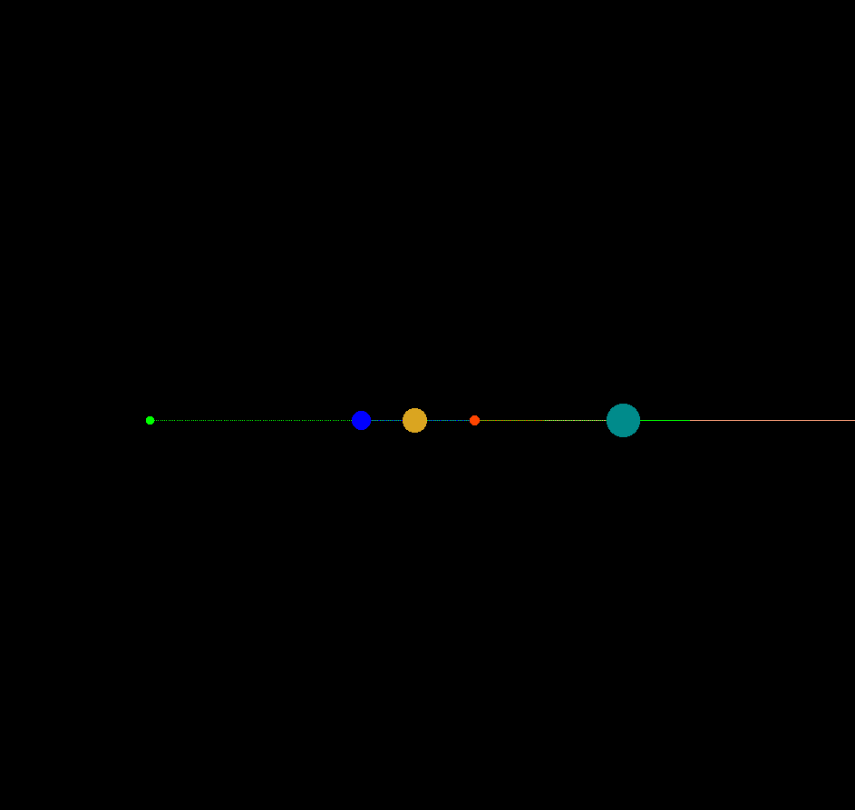

On peut observer qu'au lieu de maintenir les planètes en orbite autour d'une étoile, les planètes continuent de se déplacer, mais sans la force gravitationnelle du Soleil pour les retenir, elles partent dans le vide interstellaire de manière linéaire.

Ce scénario nous aide à comprendre l'importance de la masse du Soleil dans le maintien de la stabilité et de l'équilibre de notre système planétaire, ainsi que les changements que notre système planétaire pourrait connaître dans les 5,5 milliards d'années à venir.

\newpage

### Scénario 3 : Égalisation des masses de la Terre et de Mars

Ce scénario nous permet de comprendre comment la masse des planètes influence leur mouvement orbital et d'observer en temps réel les conséquences de l'égalisation des masses de la Terre et de Mars dans la simulation.

Nous avons donc modifié les masses de la Terre et de Mars pour les rendre égales. Les nouvelles masses sont maintenant de l'ordre de 6.39e27 kg, soit environ 1/10ème de la masse initiale de la Terre.

Les résultats de ce scénario sont présentés dans la vidéo numéro 3.

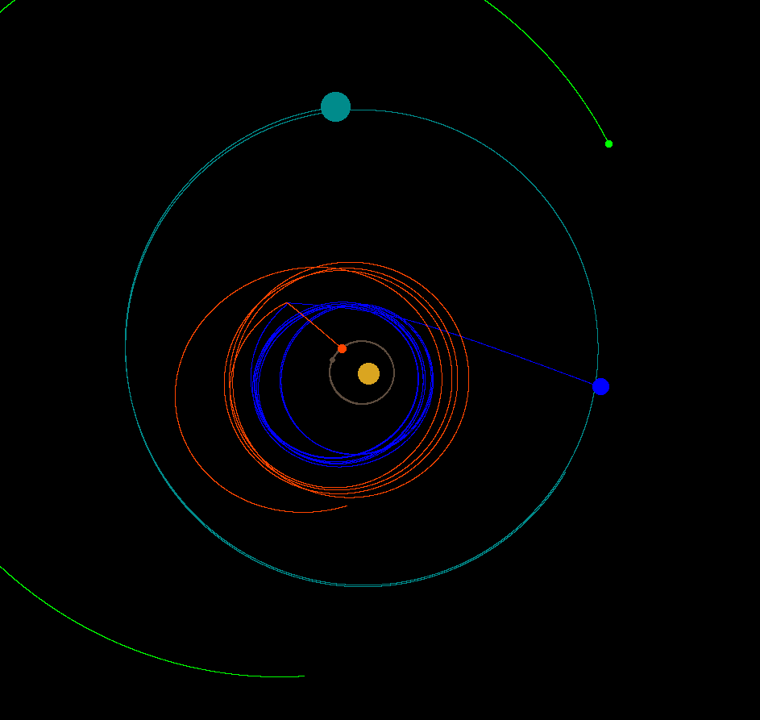

Comme on peut le voir cette modification a eu un impact significatif sur la dynamique du système planétaire simulé. Les orbites des planètes ont été altérées, et la vitesse de chaque planète a également été affectée.

En résumé, ce scénario illustre comment une modification relativement simple des paramètres, tels que les masses des planètes, peut avoir un impact majeur sur la dynamique d'un système planétaire.

### Question de la mort

On reprend les coordonées des points de la trainée de chaque planètes. Avec ces points nous créons des vecteurs qui pointent vers la Terre. Puis nous faisons la moyenne de ces vecteurs avec la fonction CalcAverage.
En comparant les moyennes des distances de toutes les planètes, on peut déterminer quelle planète a, en moyenne, été la plus proche de la Terre durant la période simulée, Mercure.

## 4. Conclusion

Ce projet nous a permis de non seulement de mettre en pratique nos connaissances théoriques sur les lois de Newton mais en plus de les appliquer. On a donc pu voir le potentiel incroyable qu'offrent les simulations numériques. 

Les résultats obtenus ont été à la hauteur de nos attentes et nous avons même réussi à déssiner la trajectoire de chacune des planètes ce qui rajoute un atout visuel pour ntore simulation. 

Concernant les possibilités d'amélioration pour ce projet, on pourrait par exemple implémenter la création de plusieurs systèmes solaires ou encore enrichir la simulation en rajoutant des sattelites autour des planètes.

En conclusion, les leçons tirées de ce projet nous seront d'une grande utilité dans notre parcours à l'avenir. 

## 5. Table des Figures

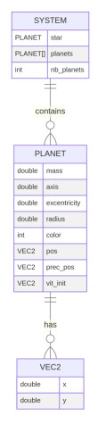

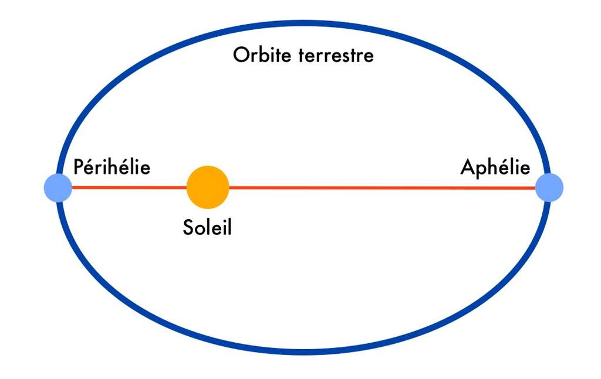

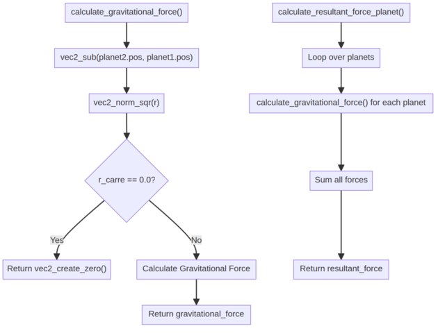

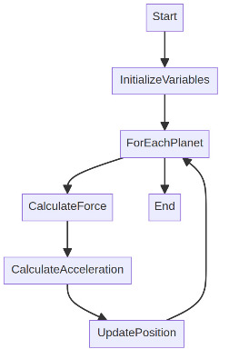

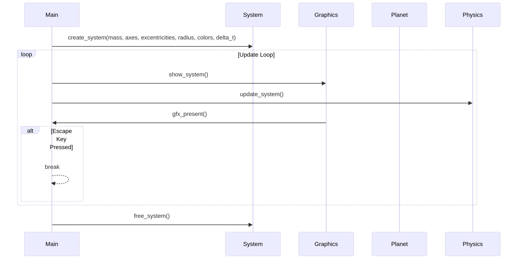

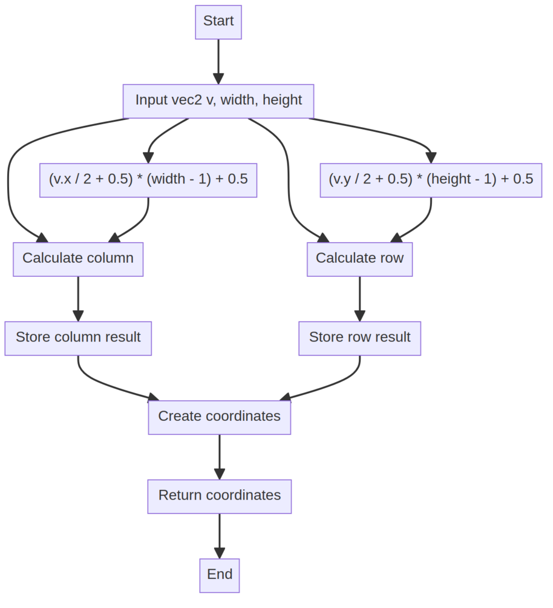


